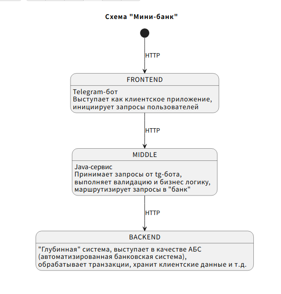

## Практический проект "Мини-банк" в рамках Backend-академии GPB IT Factory

### Middle слой представляющий собой отдельный сервис

#### Студент Хабибуллин И.Ф.

<details>
    <summary><b>Краткое описание проекта Мини-банк</b></summary>  

В рамках практики мы разработаем "Мини-банк", который будет состоять из трёх компонентов:
1. `frontend` (telegram-bot на java/kotlin);
2. `middle-слой` (java/kotlin-сервис);
3. `backend` (java/kotlin-сервис).

    - ниже представлена схема

    <details>
        <summary><b>Схема в виде PlantUML </b></summary>

            @startuml
                title Схема "Мини-банк"

                [*] --> FRONTEND : HTTP
           
                FRONTEND : Telegram-бот
                FRONTEND : Выступает как клиентское приложение,
                FRONTEND : инициирует запросы пользователей
                FRONTEND --> MIDDLE : HTTP
           
                MIDDLE : Java-сервис
                MIDDLE : Принимает запросы от tg-бота,
                MIDDLE : выполняет валидацию и бизнес логику,
                MIDDLE : маршрутизирует запросы в "банк"
                MIDDLE --> BACKEND : HTTP

                BACKEND : "Глубинная" система, выступает в качестве АБС
                BACKEND : (автоматизированная банковская система),
                BACKEND : обрабатывает транзакции, хранит клиентские данные и т.д.
            @endtuml

    </details>

    <details>
        <summary><b>Схема в виде рисунка</b></summary>  

   
    </details>

4. Планируемый набор команд:
   <details>
    <summary><b>Раскрыть команды</b></summary>
   
   - `/register` - первичное оформление пользователя в нашем банке, из данных мы знаем только то, что предоставляет нам Telegram;
   - `/createaccount` - открытие счёта в нашем Мини-банке. В данный момент у клиента может быть только один счёт;
   - `/currentbalance` - получить текущий баланс открытого пользователем счёта;
   - `/transfer [toTelegramUser] [amount]` - перевод средств со счёта текущего пользователя на другой счёт по имени пользователя. `toTelegramUser` - пользователь, на счёт которого совершается перевод, `amount` - сумма перевода.
   </details>
 
</details>


<details>
    <summary><b>Как запустить проект?</b></summary>

1. Скачать проект по ссылке с ```github.com``` в виде zip архива и разахивировать папку ```khabibullin-middle-servive```
2. Или склонировать проект командой в терминале/командной строке
```bash
git clone git@github.com:gpb-it-factory/khabibullin-middle-service.git
```
3. Перейти в папку ```khabibullin-middle-service```
4. В папке набрать команду в терминале/командной строке
```bash
./gradlew clean && ./gradlew assemble
```
5. После этого набрать команду в терминале/командной строке команду из блока кода ниже
```bash
java -jar build/libs/khabibullin-middle-service-0.1.jar
```


</details>

<details>
    <summary><b>Технологический стэк</b></summary>  


1. Языки: [Java 17](https://www.java.com/ru/)+ в виде реализации [Axiom JDK](https://axiomjdk.ru/pages/downloads/#/java-17-lts)
2. Система сборки: [Gradle 8.7](https://gradle.org/)
3. Базовый фреймворк: [Spring Boot](https://spring.io/projects/spring-boot)
4. Дополнительные библиотекам: [JUnit 5](https://junit.org/junit5/), [Testcontainers](https://testcontainers.com/), [AssertJ](https://assertj.github.io/doc/), [Logback](https://logback.qos.ch/), [Micrometer](https://micrometer.io/), [MapStruct](https://mapstruct.org/)
</details>